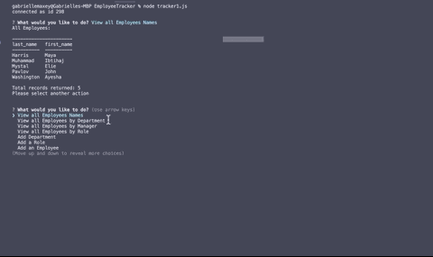
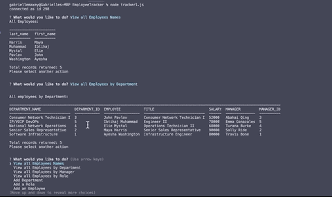
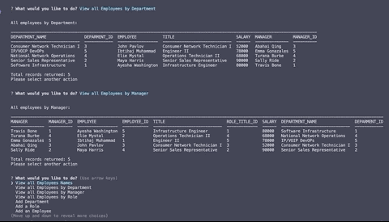
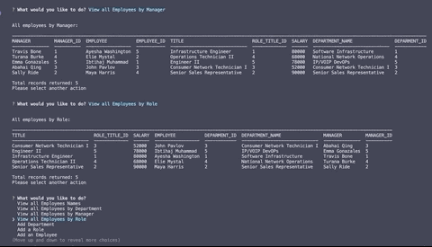
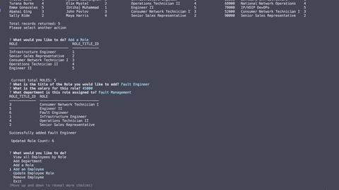
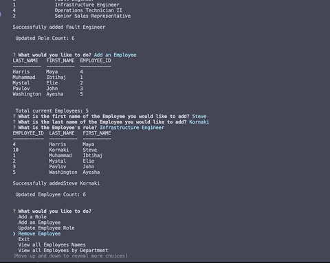

  

  # Employee Tracker CMS

  ## Description
 This Console Management System is Node.js based Employee Tracker. Through a series of prompts you can view, update, add, or remove data. Data is stored in via a MySQL database.

*view by Employee*

*view by department*

*view by manager*

*view by role*

*add department*

*add role*

*add employee*

*update employee role*

![picture] UNAVAILABLE

*remove employee*

  ## Table of Contents
  * [Description](#Description)
  * [Deployed Website](#Deployed)
  * [Installation](#Installation)
  * [Contributing](#Contributing)
  * [Tests](#Tests)
  * [Questions](#Questions)
  * [Author](#Author)
  * [License](#License)

  ## Installation
  This is installed via Node.js with npm dependencies. Please see the package.json file for details

  ## Usage
  undefined

  ## Contributing
  Individuals may contribute by contacting the author directly.

  ## Tests
  To test the code, you can run via VScode or any other coding platform with ESlint.

  ## Questions
  Please send any questions or comments to the author listed below.

  ## Author:
  Gabrielle Maxey

  Email: gmaxeyg@gmail.com

  Github: <https://github.com/GabrielleM45>

  ## License
  *This application is Licensed under the following license:*\
  **[mit](https://choosealicense.com/licenses/mit/)**

